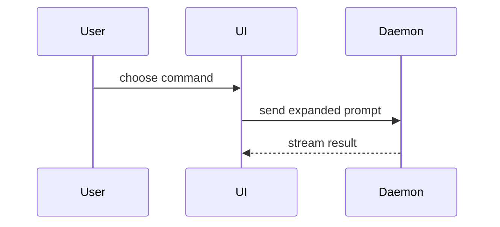

# Show Me

Help the user understand the current topic of conversation visually. Skip the preamble and keep prose brief. Pick the smallest view that makes the key point clear.

## Pick the smallest useful visual

- Show logic or an algorithm as pseudocode:

```text
on(save)
  if content is unchanged
    return cached result
  write new content
  return fresh result
```

- Show runtime control flow as a call tree:

```text
submitForm
  createSession
    persistPrompt
    launchAgent
  navigateToSession
```

- Show UI structure as a component tree, including state and module boundaries that matter:

```tsx
<SessionPage> (apps/example/src/routes/session.tsx)
  useSessionEvents()
  <SessionToolbar>
    <RunSkillButton> (packages/ui)
```

- Show file responsibility or a broad refactor as a shallow file tree:

```text
src/
├── commands/       # parses user actions
├── sessions/       # owns session state
└── transport/      # sends API requests
```

- Show component interaction, control flow, or data flow with Mermaid:



- Use `diff` when the point is what changes and the surrounding shape already exists. Match the diff shape to the topic.

For a component change:

```diff
 <SessionPage>
   useSessionEvents()
   <SessionToolbar>
+    <RunSkillButton />
   <SessionTimeline>
+    <SkillResultCard />
```

For a file-layout change:

```diff
 src/
 ├── commands/
+│   └── show-me.ts       # expands the slash command
 ├── sessions/
-└── transport.ts
+└── transport/
+    ├── client.ts
+    └── stream.ts
```

For a call-tree or call-stack change:

```diff
 submitForm
   createSession
     persistPrompt
+    expandSkillMention
     launchAgent
-  navigateToSession
+  navigateToSession
+    subscribeToEvents
```

For a state or control-flow change:

```diff
 on(save)
-  write content
+  if content is unchanged
+    return cached result
+  write new content
+  invalidate cache
```

- Show the whole block when most of it is new, when omitted context would hide ownership or order, or when the user needs a copyable target shape:

```ts
function expandSkill(command: string): string {
  const skillName = command.slice(1)
  return `use the ${skillName} skill`
}
```

## Use Atelier's visual surfaces

Escalate to one focused HTML artifact when spatial layout, grouping, color, comparison, or interaction communicates the point better than a text diagram. A show-me artifact is an explanation, not a production UI or a broad design exploration.

1. Write the artifact to `/work/artifacts/show-me-{short-description}.html`. The directory is intentionally ignored by this repository.
2. Make it self-contained and responsive for Atelier's roughly 860px-wide preview and narrow screens. Prefer HTML and CSS, with inline SVG only when lines or geometry matter. Do not depend on CDN scripts or fonts.
3. Use real labels and data. Match the product's colors, typography, spacing, and components when explaining an existing UI. When the topic is Atelier itself, inspect and reuse its design-system tokens and patterns.
4. Include only the states, boundaries, and annotations needed for the current point. For a static explanation, avoid controls that do not improve understanding.
5. Present the file inline in the response with exactly this Markdown shape:

```markdown

```

Atelier automatically renders referenced HTML in an inline iframe, so do not use `open`, start a server, or call the presentation tool for a static artifact. If the explanation genuinely requires live interaction or a running application, use the available Atelier browser presentation instead: run the server in tmux on any available TCP port except `2999` (reserved for the workspace gateway), bind to `127.0.0.1` or `0.0.0.0`, allow any preview hostname, and present its localhost URL.

Use screenshots or video only when the point is actual rendered behavior that an explanatory HTML diagram would misrepresent. Reference those files with `atelier-embed:` too. Link editable source with an `atelier://file/...` URL when the user will benefit from inspecting it.

If the task is to compare several UI directions or validate a state model rather than explain the current topic, use the `prototype` skill instead of turning this artifact into a miniature prototype.

## Guidance

Place each visual next to the short text it supports. Keep only the calls, files, props, states, and boundaries needed to answer the user's current question or resolve the current discussion point.

You may use one format or several; it is unlikely you need all of them. Do not overwhelm the user.

<!-- Adapted for Atelier from HumanLayer's show-me skill: https://github.com/humanlayer/skills/tree/main/plugins/show-me -->
